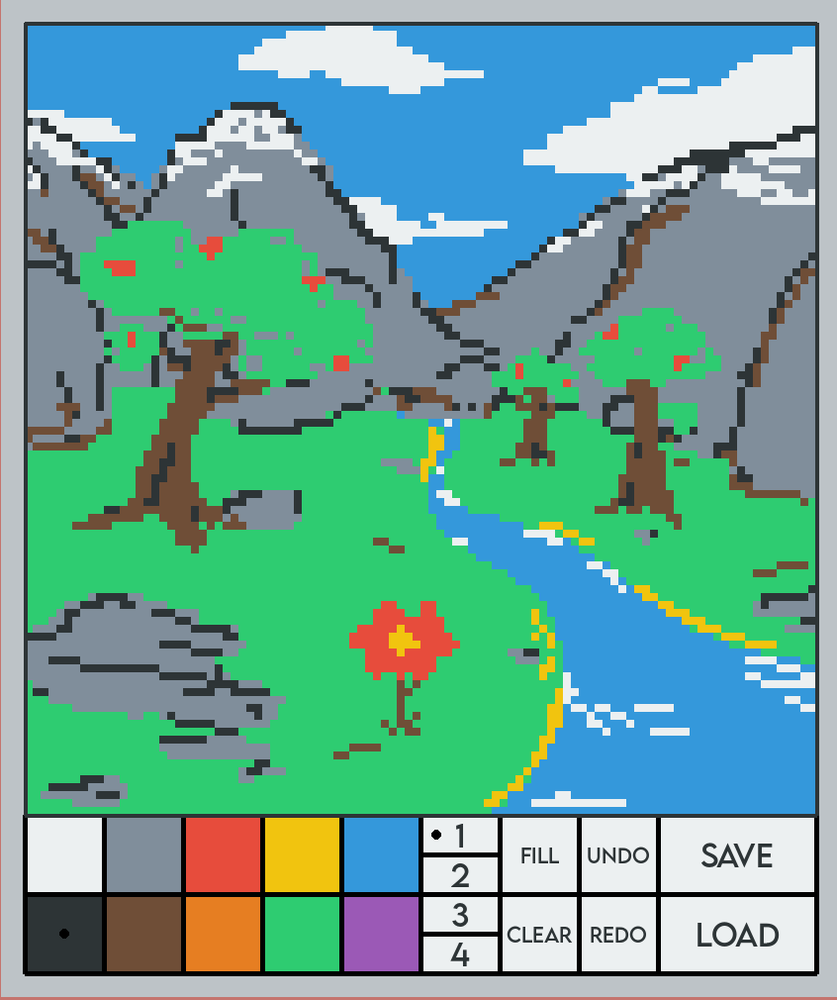

<h1 align="left">Retro Paint Application</h1>

Paint software with multiple colors, brush sizes, fill, undo and redo, and file imports and exports.

<h2>Download</h2>

Install Python dependices Pygame and tkinter and run the main.py file

